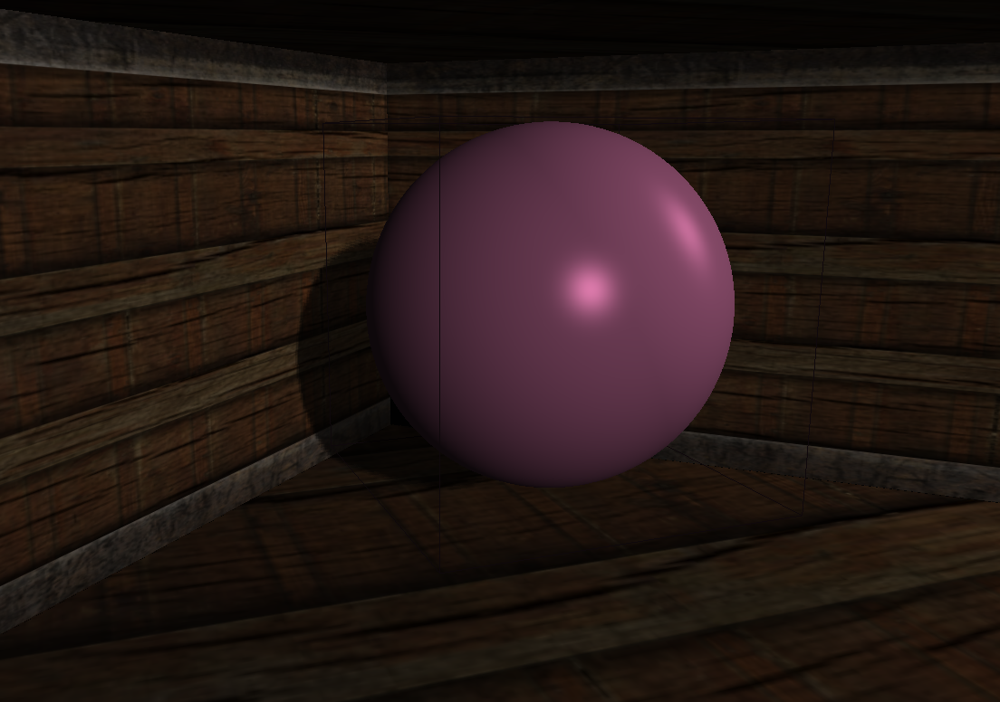

## OpenGL Introduction

This is an introductory project about OpenGL. 

In order to simplify the creation of small scenes that consist of basic geometry, the following geometric objects were introduced: 
- Triangle 
- Quad
- Circle 
- Cuboid 
- Sphere 

An oriented bounding box (OBB) collision system is implemented between the camera and the scene objects. 

For lighting, the Phong lighting model is used. For shadows, shadow mapping is implemented for the directional light.

### Sources
- [Learn OpenGL](https://learnopengl.com/Introduction)